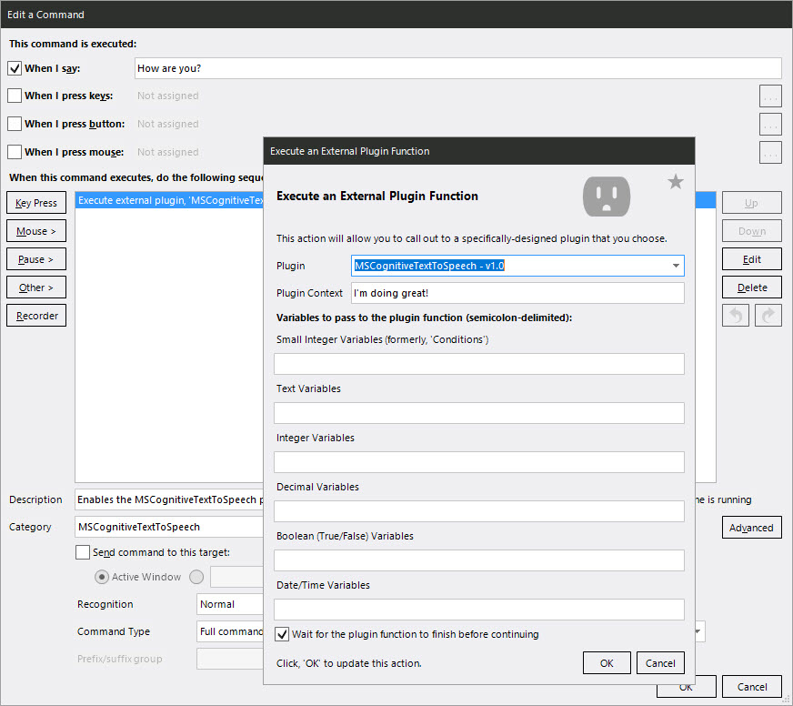

# Microsoft Cognitive Speech plug-in for Voice Attack

Enables the use of the more advanced text-to-speech capabilities in [Voice Attack](https://voiceattack.com/) profiles.  Currently Voice Attack only supports the voices that come natively in Windows which aren't the greatest.   Microsoft has better ones online, especially the more human sounding "neural" voices.  

Try out examples of the [Cognitive Service voices](https://azure.microsoft.com/en-us/services/cognitive-services/text-to-speech/#features) to see what you think.

If you enjoy the plug-in, feel free to [buy me coffee](https://www.paypal.com/donate?hosted_button_id=ZEJ4UZGGSM9Q8) :)

 

## Features
- Use any of the **voices included in Cognitive Services** (including the more human sounding **"neural" voices**)
- Native support for **international languages** (provided by Microsoft Cognitive Services)
- (Optional) Add a **"Radio" effect** so spoken text sounds like its coming over a radio (ideal for plane/combat time simulations)
- (Optional) Ability to use **SSML** for fine-control of how the speech is synthesized 
- (Optional) Ability to **cache synthesized audio** outputs locally to avoid additional service calls
- Automatic clean up of cached files (configurable expiration period)
- Ability to override config options by using Voice Attack variables (i.e. MSCognitiveTextToSpeech.DefaultVoiceName)

## Dependencies

- Azure Speech service subscription (free tier will work fine, especially with caching turned on)
- Voice Attack (free or paid)
  
## Who is this for?
Mainly gamers and flight sim players who want the better speech capabilities for their Voice Attack commands.  I use it for Microsoft Flight Simulator 2020 to simulate having a co-pilot but you can use it for really anything where you want to a command to say something.

## Inspiration and Kudos
Other people and work that inspired and help me accomplish this project:
- **Virtual Voyager** : [Immersive Aviation for MSFS 2020](https://www.youtube.com/watch?v=wQ5Ed-C_dbs)
- **Mark Heath and contributors** to [NAudio](https://github.com/naudio/NAudio) 
- **MRacko** for [MSFS Mobile Companion App](https://github.com/mracko/MSFS-Mobile-Companion-App)
  
## Setup

I'll work on creating a Youtube video that runs through this, in the meantime, here are the steps:

1. Create a free [Azure user account](url:https://docs.microsoft.com/en-us/azure/cognitive-services/speech-service/overview#try-the-speech-service-for-free) if you don't have one
2. Setup a [Speech Service subcription](url:https://docs.microsoft.com/en-us/azure/cognitive-services/speech-service/overview#try-the-speech-service-for-free) in your account (free tier)
3. Get the **Subscription Key** and **Region** for your Speech subscription
4. Download the latest release of the plug-in (zip file)
5. Open/extract the zip file, copy the **MSCognitiveTextToSpeech** folder to your Voice Attack "apps" folder (i.e. Voice Attack/apps/MSCognitiveTextToSpeech/)
6. Edit the settings in the **MSCognitiveTextToSpeech.dll.config** file  
     - Modify AzureSubscriptionKey and AzureRegion settings
     - Review and modify any of the other settings if you don't like the defaults
7. In Voice Attack, go Options (wrench icon) > General >  ensure "**Enable Plug-in Support**" is enabled
8. **Run a test** :
   - Add a command that calls the plug-in (under the Other > Advanced > Execute an External Plugin Function)
   - Set the "Context" field to the text your want to be spoken (it also supports tokens)
   - Ensure the "Wait for the plug-in function to finish before continuing" is enabled
   - Save the command then execute it.  You should hear the text spoken out loud in the voice you selected if it's working.  If not, see the Troubleshooting section below.

>**Note**: the plug-in is pre-configured to save (cache) the generated audio files into the Voice Attack/Sounds/MSCognitiveTextToSpeech folder.  You can disable this or change the location in the "Voice Attack/Apps/MSCognitiveTextToSpeech/MSCognitiveTextToSpeech.dll.config" file

## FAQ

#### Is this free?  Are there any costs?
- The plug-in is completely free to use.  
- Voice Attack has a free and a paid option ([details](https://voiceattack.com/purchase.aspx)) Paid is typically only $10 USD.   
- Cognitive Services supports 5 million characters for standard voices and 0.5 million characters for neural voices in the **free tier**.  This should be plenty for most people especially with the way the plug-in caches speech for text phrases it's previously done.   More details on can be [found here](https://azure.microsoft.com/en-us/pricing/details/cognitive-services/speech-services/)  

#### Are you tracking usage or anything else with the plug-in?
No.  Anything you run through plug-in is only seen by Cognitive Services (for the text-to-speech operation) and that is within the bounds of your own account.  

#### Are you making money from this?
Nope, nada, but if you enjoy it, feel free to [buy me coffee](https://www.paypal.com/donate?hosted_button_id=ZEJ4UZGGSM9Q8) :)

#### What is the caching based on?
It's based on the SSML xml message sent to the speech service.  When you change what's in the Content field for the call to the plug-in OR the Voice Name or Voice Language fields in the config, an new wav file will get saved/cached.

#### How is the cache managed?
Each time Voice Attack is started, the plug-in loads and it deletes any files from the cache folder that haven't been accessed in the last 30 days (default).  You can change the number of days in the config file as well.

#### What is SSML?  How or why should I use it?
It's completely optional and really only needed if you want to go deeper into how the precise your want the speech.  For example, some voices support emotion, or you can add pauses, inflections, improve pronouciation, etc.

- [Micorosft documentation on the SSML syntax and capabilities](https://docs.microsoft.com/en-us/azure/cognitive-services/speech-service/speech-synthesis-markup)
- Microsoft's online Speech generation tools: [Simple Editor](https://speech.microsoft.com/audiocontentcreation) | [Advanced Editor](https://azure.microsoft.com/en-us/services/cognitive-services/text-to-speech/)

>**Note**: the plug-in generates the \<speech\> and \<voice\> tags.  Anything you put in the "Context" field on the call to the lug-in will be placed inside the \<voice\> tag.

#### Can I use Voice Attack Tokens in the Context field?
Absolutely.  Just like in other places, Voice Attack will process the tokens before it gets to the plug-in.  The resulting text is what gets sent off for the speech generation.  For example : **[Hi, Hello;Greetings] my friend** would randomly become one of the 3 variants : Hi my friend, Hello my friend, Greetings my friend.

#### How can I change settings using variables (override the config file)?
Each of the settings available in the config file can also be set using a Voice Attack variable.  The variables are the combination of the prefix **MSCognitiveTextToSpeech.** and the KeyName from the config file.  Examples: MSCognitiveTextToSpeech.DefaultVoiceName, MSCognitiveTextToSpeech.AddRadioEffect.  If the config and variable use different settings, the variable takes precedence.  

>**Note**: the variables need to be the correct variable type (i.e settings that are true/false need to use "Set a Boolean type", anything that is a number should be an Int, Text should a Text type.)

## Troubleshooting

If the following doesn't help, post an issue or question on the Issues page.

#### The plug-in isn't showing up in Voice Attack after being installed

Make sure you're using the version of the plug-in that matches you Voice Attack install (i.e. x86 plug-in if you'zre using 32-bit Voice Attack (most people).  Use the x64 plug-in if the Options window title in Voice Attack says "64-bit")

